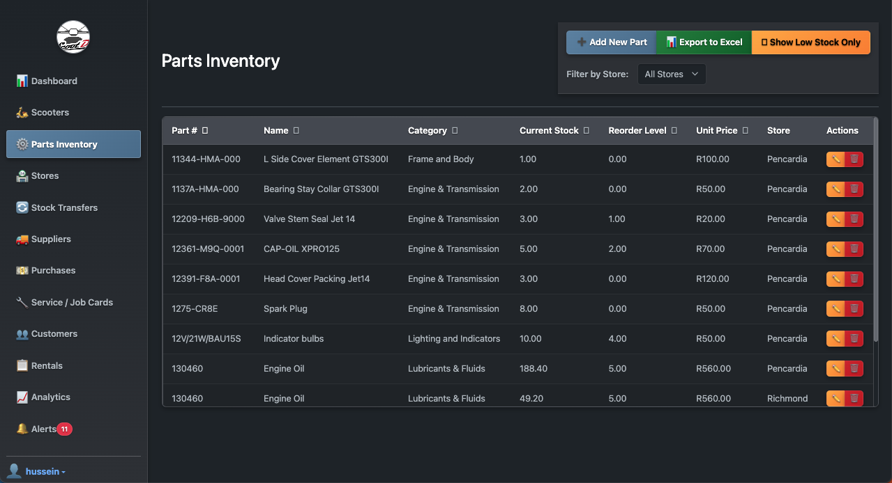
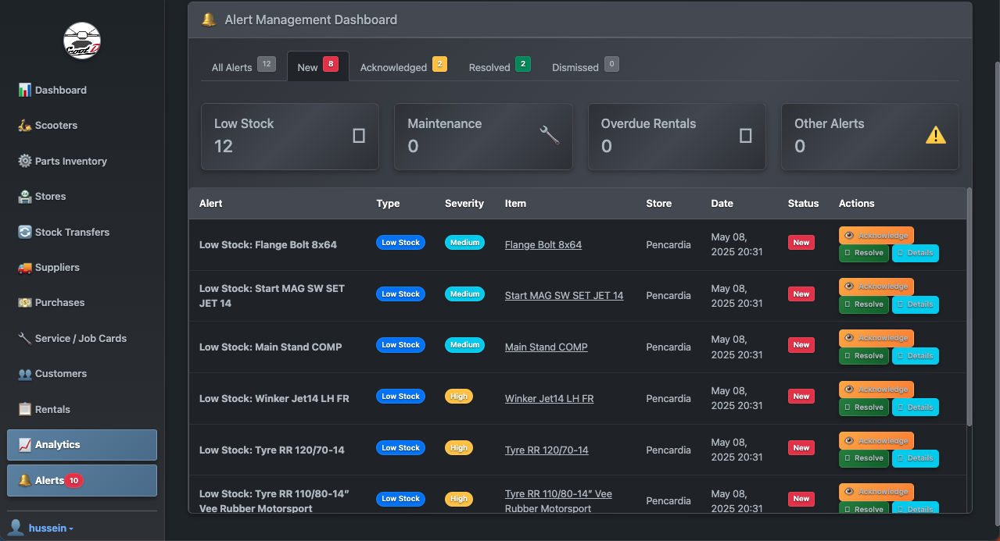

# Scooter Rental Management System - User Guide

This user guide provides step-by-step instructions for using the Scooter Rental Management System.

## Table of Contents

1. [Getting Started](#getting-started)
2. [Dashboard Overview](#dashboard-overview)
3. [Scooter Management](#scooter-management)
4. [Parts Inventory](#parts-inventory)
5. [Store Management](#store-management)
6. [Stock Transfers](#stock-transfers)
7. [Supplier Management](#supplier-management)
8. [Purchase Management](#purchase-management)
9. [Service and Job Cards](#service-and-job-cards)
10. [Customer Management](#customer-management)
11. [Rental Management](#rental-management)
12. [Analytics and Reporting](#analytics-and-reporting)
13. [Alert System](#alert-system)

---

## Getting Started

### Logging In

1. Navigate to the login page
2. Enter your username and password
3. Click "Sign In"

---

## Dashboard Overview

The dashboard provides a high-level overview of your business operations, including:

- Total scooters and available scooters
- Recent rentals
- Active job cards
- Low stock items
- Recent stock transfers
- Statistical charts and graphs

---

## Scooter Management

Manage your scooter fleet, including adding new scooters, tracking maintenance, and updating status.

### Viewing Scooters

The scooter list provides an overview of all scooters in your inventory.

### Adding a New Scooter

1. Click "Add New Scooter" from the scooter list page
2. Fill in all required details
3. Click "Save"

### Scooter Details

View comprehensive details about a scooter, including:
- Specifications
- Maintenance history
- Rental history
- Current status

---

## Parts Inventory

Track and manage scooter parts and consumables across your stores.

### Viewing Parts

The parts inventory list shows all parts with their respective stocks.

### Adding New Parts

1. Click "Add New Part" from the parts list page
2. Fill in all required details
3. Click "Save"

---

## Store Management

Manage your physical store locations that hold inventory.

### Viewing Stores

The store list shows all your locations.

### Adding a New Store

1. Click "Add New Store" from the store list page
2. Fill in store details
3. Click "Save"

---

## Stock Transfers

Move parts inventory between different store locations.

### Viewing Stock Transfers

The stock transfer list shows all transfers and their statuses.

### Creating a New Stock Transfer

1. Click "New Stock Transfer" from the stock transfer list page
2. Select source and destination stores
3. Select the part to transfer and quantity
4. Click "Save"

Note: Transfer numbers are automatically generated with the format TRF-YYYYMMDD-XXXX.

---

## Supplier Management

Manage your suppliers for parts and scooters.

### Viewing Suppliers

The supplier list shows all your suppliers.

### Adding a New Supplier

1. Click "Add New Supplier" from the supplier list page
2. Fill in supplier details
3. Click "Save"

---

## Purchase Management

Track and manage purchases from suppliers.

### Viewing Purchases

The purchase list shows all purchase invoices.

### Creating a New Purchase

1. Click "Create New Purchase" from the purchase list page
2. Select the supplier and fill in invoice details
3. Add purchase items
4. Click "Save"

---

## Service and Job Cards

Manage scooter maintenance and repairs.

### Viewing Job Cards

The job card list shows all maintenance records.

### Creating a New Job Card

1. Click "Create New Job Card" from the job card list page
2. Select the scooter and technician
3. Add service items and parts used
4. Click "Save"

---

## Customer Management

Manage customer profiles and information.

### Viewing Customers

The customer list shows all registered customers.

### Adding a New Customer

1. Click "Add New Customer" from the customer list page
2. Fill in customer details
3. Click "Save"

---

## Rental Management

Track and manage scooter rentals.

### Viewing Rentals

The rental list shows all rental records.

### Creating a New Rental

1. Click "Create New Rental" from the rental list page
2. Select customer and scooter
3. Set rental period and rate
4. Add deposit information
5. Click "Save"

---

## Analytics and Reporting

Access data insights and business metrics.

### Analytics Dashboard

The analytics dashboard provides visualizations of key performance indicators.

### Generating Reports

1. Navigate to the appropriate report from the analytics menu
2. Set filtering criteria if needed
3. Click "Generate Report"
4. Export to Excel if required

---

## Alert System

Stay informed about inventory levels, maintenance needs, and rental status.

### Viewing Alerts

The alerts dashboard shows all active alerts.

### Managing Alerts

1. Click on an alert to view details
2. Take appropriate action
3. Mark as acknowledged or resolved

---

## User Settings

### Profile Settings

Manage your user profile and preferences.

### System Settings

For administrators, configure system-wide settings.

---

## Tips and Best Practices

1. **Regular Backups**: Ensure your database is backed up regularly
2. **Stock Monitoring**: Check the alert system daily for low stock notifications
3. **Preventive Maintenance**: Schedule regular scooter maintenance
4. **Customer Verification**: Always verify customer identity with valid ID for new rentals
5. **Inventory Audits**: Conduct physical inventory counts monthly
6. **Security**: Log out when leaving your workstation unattended

---

For additional support or questions, please contact the system administrator Hussein Madan Migadde Tel: 0837288948.

*Note: This user guide is based on version 1.0 of the Scooter Rental Management System. Screenshots may differ slightly in future versions.*